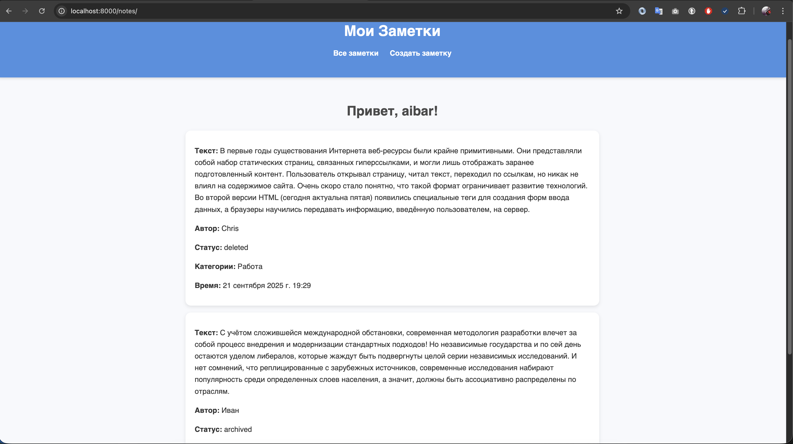
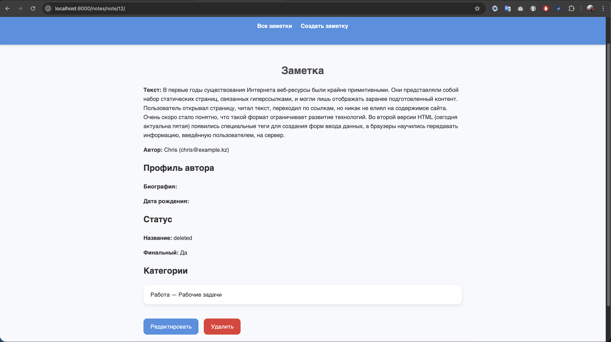
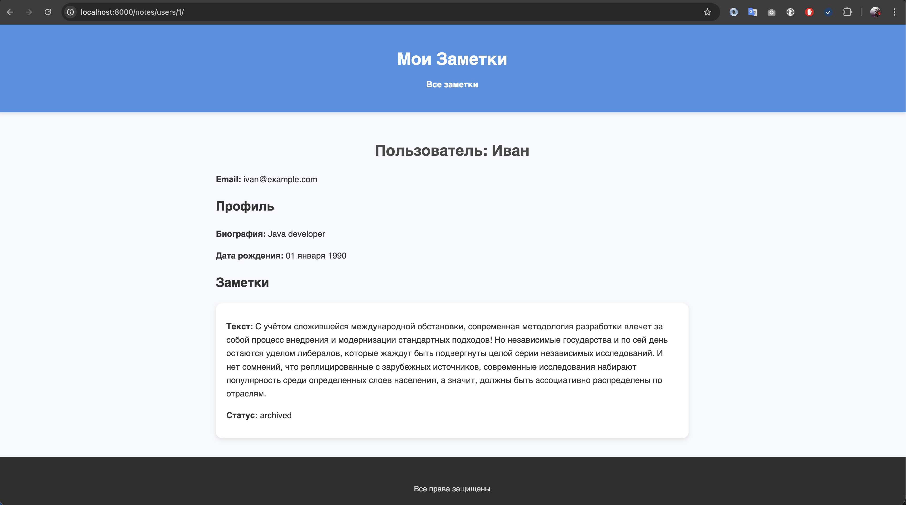
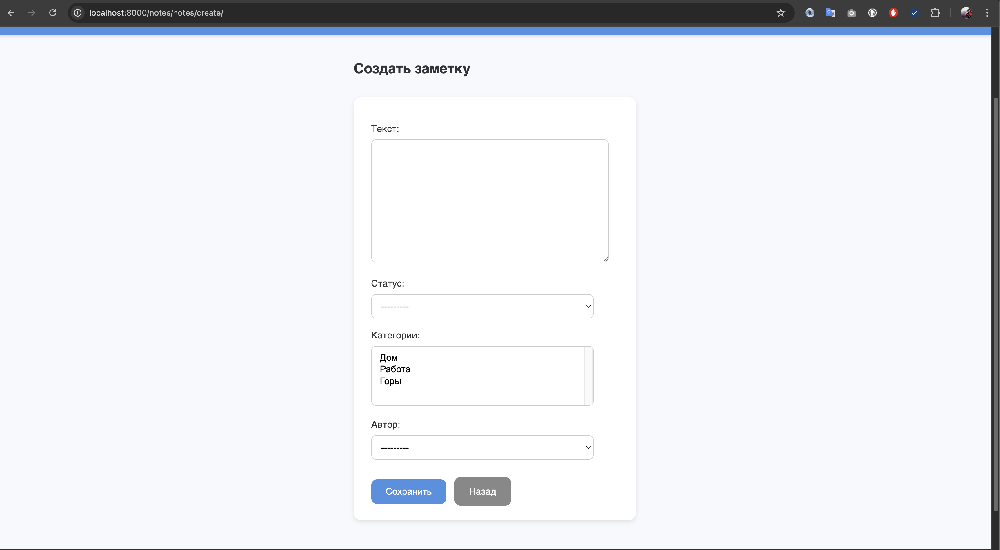
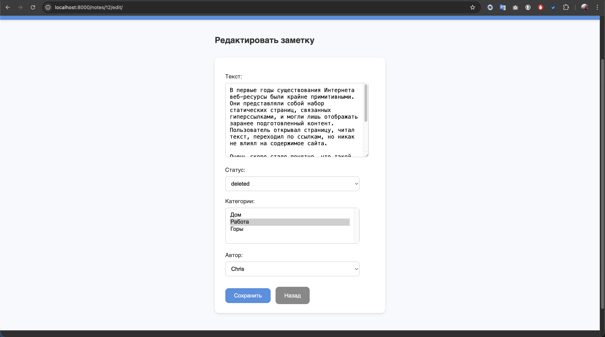
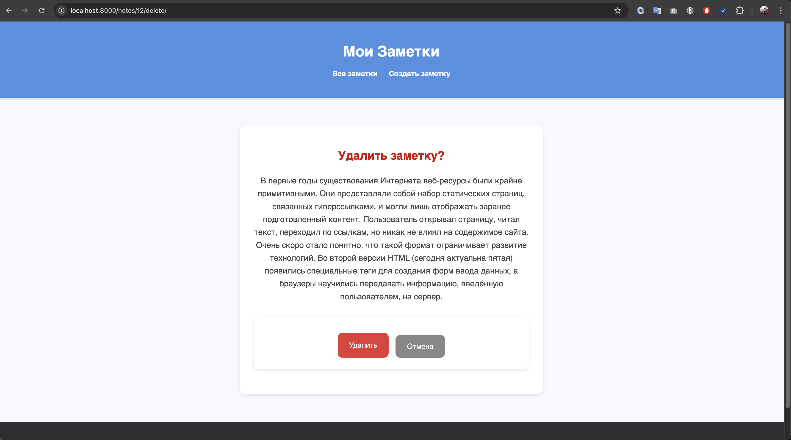

# Django Form
Сервис для хранения заметок с категориями и статусами и Админкой.  
Проект построен на **Django** и **PostgreSQL**, запускается в контейнерах с помощью **Docker Compose**.  

---

## 🚀 Что реализовано

- Настроено окружение в Docker:
  - отдельный контейнер для PostgreSQL;
  - отдельный контейнер для Django-приложения;
  - параметры подключений вынесены в `.env`.
- Django-проект с приложением `notes`:
  - Модель `User` с профилем `UserProfile` (связь **один к одному**);
  - Модель `Note` (заметки) со связями:
    - **один ко многим** с пользователями (`User`);
    - **один ко многим** со статусами (`Status`);
    - **многие ко многим** с категориями (`Category`);
  - Модель `Status` (например: `active`, `archived`, `deleted`);
  - Модель `Category` (категории заметок).
  - Реализован CRUD для модели **Note** через формы и шаблоны.

---

## 🔹 Новые страницы (CRUD)

### 1. Создание заметки
- **URL:** `/notes/create/`  
- Форма для добавления заметки.  
- Поля: `text`, `status`, `categories`, `author`.  
- После успешного создания → редирект на главную.

---

### 2. Редактирование заметки
- **URL:** `/notes/<int:note_id>/edit/`  
- Форма с предзаполненными данными.  
- После сохранения → редирект на страницу заметки.

---

### 3. Удаление заметки
- **URL:** `/notes/<int:note_id>/delete/`  
- Страница подтверждения удаления.  
- После удаления → редирект на главную.

---


## ⚙️ Запуск проекта

### 1. Клонируй репозиторий
```bash
git clone git@github.com:Solva-technology/solva-notes-models-quasar696.git
cd notes_service
```
### 2. Подними контейнеры
```bash
docker-compose up -d --build
```
### 3. Сделай миграции
```bash
docker-compose exec web python manage.py makemigrations
docker-compose exec web python manage.py migrate

```
### 4. Запусти сервер (если не запущен)
```bash
docker-compose up
```
## 🛠 Проверка в Django Admin
### Открой Django Admin по адресу:

```bash
http://localhost:8000/admin
```

## 📷 Примеры ответов API

### 🔹 Главная страница Все заметки (`""`)


---

### 🔹 Заметка по ID (`note/<int:note_id>/`)


---

### 🔹 Пользователь по ID (`user/<int:user_id>/`)


---

### 🔹 Создаnm Заметкe (`notes/create/`)


---

### 🔹 Редактировать заметку (`notes/<int:note_id>/edit/`)


---

### 🔹 Удалить заметку (`notes/<int:note_id>/delete/`)


---